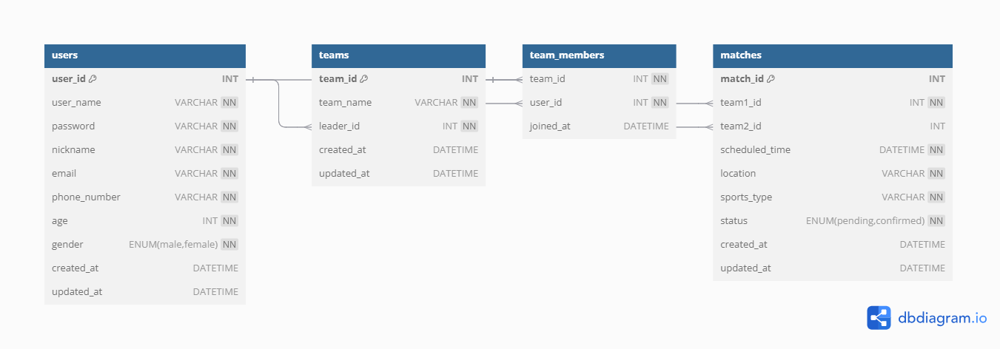
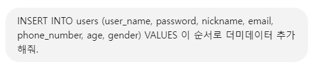
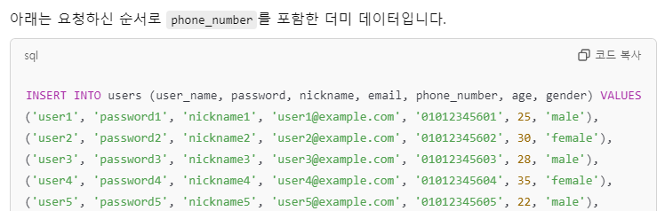

# Final Project - DASH MATCH
---
## 1. 프로젝트 소개
- **목표**: 팀 생성과 관리, 매치 생성 및 상대 팀과의 연결을 지원하는 DASH MATCH를 통해 쉽게 원하는 팀을 구성하여 상대방과 원하는 조건으로 경기를 진행할 수 있음.
- **타겟**
  - 혼자서는 할 수 없는 스포츠를 접하고 싶은 유저
  - 팀을 구성하였지만 조건에 맞는 상대를 찾기 힘든 팀
- **기대효과** 
  - DASH MATCH를 통해 팀을 쉽게 구성하고 관리할 수 있음
  - 원하는 조건에 따라 빠르게 상대 팀을 매칭할 수 있음
  - 지역 내 스포츠 활동 활성화

## 2. 팀원 및 역할 분담
- **최보성**: Spring Boot를 활용한 back 구현, Vue를 활용한 User, Match 관련 front 구현
- **이윤준**: Figma 제작, Vue를 활용한 Team 관련 front 구현, css 스타일링

## 3. 프로젝트 진행 과정
1. **아이디어 회의**
   - 프로젝트의 주제를 정하기 위해 팀원들과 함께 아이디어를 논의함.
   - 최종적으로 '팀을 구성하여 매칭을 통해 같은 조건의 상대 팀 구하기'라는 운동 관련 주제를 선정함.

2. **API 명세서 및 ERD 설계**
   - 선정된 주제에 기반하여 프로젝트에서 필요한 메서드와 데이터 구조를 정리함.
   - 이를 바탕으로 **API 명세서**와 **ERD(Entity-Relationship Diagram)**를 작성하여 데이터베이스 스키마와 API 호출 구조를 체계적으로 정의함.

3. **역할 분담**
   - **Java Spring Boot**를 활용하여 **user, team, match, session**과 관련된 백엔드 기능 구현
   - 팀원은 **Figma**를 활용하여 웹사이트 디자인을 제작함.

4. **프론트엔드 구현**
   - Figma에서 제작된 디자인을 기반으로 **Vue.js**를 사용하여 프론트엔드 개발을 진행함.
   - 팀원과 협력하여 백엔드 API를 연결하고 프론트엔드와 통합하여 웹사이트의 모든 기능을 구현함.

5. **CSS 스타일링**
   - 기능 구현이 완료된 후, 웹사이트의 사용자 경험(UX)과 사용자 인터페이스(UI)를 개선하기 위해 CSS를 활용하여 사이트를 디자인함.

## 4. 주요 기술 스택
- **Backend**: Java Spring Boot, MyBatis
- **Frontend**: Vue.js, HTML, JavaScript, CSS, Bootstrap
- **Design**: Figma
- **Database**: MySQL
- **API Communication**: Axios

## 5. API 명세서
| HTTP 메서드 | API path              | 설명                               | Request Body                                                   | Response Body                                                |
|-------------|------------------------|------------------------------------|------------------------------------------------------------|---------------------------------------------------------|
| POST        | /api/users/signup          | 회원가입(새 사용자를 생성)         | `{ "username": "testuser", "email": "test@example.com", "password": "password123" }` | `{ "message": "User registered successfully" }`         |
| POST        | /api/users/login           | 로그인 처리                        | `{ "username": "testuser", "password": "password123" }`      | `{ "message": "Login successful", "user": { "userId": 1, "username": "testuser", "email": "test@example.com" } }` |
| POST        | /api/users/logout          | 로그아웃 처리                      | N/A                                                        | `{ "message": "Logout successful" }`                     |
| GET         | /api/users                 | 전체 유저 리스트 조회              | N/A                                                        | `[ { "userId": 1, "username": "testuser", "email": "test@example.com" }, { "userId": 2, "username": "testuser2", "email": "test2@example.com" } ... ]` |
| GET         | /api/users/{userId}        | userId로 사용자 세부정보 조회      | N/A                                                        | `{ "userId": 1, "username": "testuser", "email": "test@example.com" }` |
| PUT         | /api/users/{userId}        | 사용자 정보 업데이트              | `{ "username": "updateduser", "email": "new@example.com" }` | `{ "userId": 1, "username": "updateduser", "email": "new@example.com" }` |
| DELETE      | /api/users/{userId}        | 사용자 삭제                       | N/A                                                        | `{ "message": "User deleted successfully" }`                |
| GET         | /api/users/{userId}/teams  | userId로 사용자가 속한 팀 리스트 조회 | N/A                                                        | `[ { "teamId": 1, "teamName": "Team A", "leaderId": 1 }, { "teamId": 2, "teamName": "Team B", "leaderId": 2 } ]` |
| GET         | /api/session               | 현재 세션의 유저 정보 확인         | N/A                                                        | `{ "authenticated": true, "user": { "userId": 1, "username": "testuser", "email": "test@example.com" } }` 또는 `{ "authenticated": false }` |
| POST        | /api/teams                        | 새로운 팀을 생성합니다                  | `{ "teamName": "Team A", "leaderId": 1 }` | `{ "teamId": 1, "teamName": "Team A", "leaderId": 1 }` |
| GET         | /api/teams                        | 전체 팀 리스트 조회                     | N/A                                 | `[ { "teamId": 1, "teamName": "Team A", "leaderId": 1 }, { "teamId": 2, "teamName": "Team B", "leaderId": 2 } ]` |
| GET         | /api/teams/{teamId}               | teamId로 팀 세부정보 조회               | N/A                                 | `{ "teamId": 1, "teamName": "Team A", "leaderId": 1 }` |
| PUT         | /api/teams/{teamId}               | 팀 정보 업데이트                        | `{ "teamName": "Updated Team Name", "leaderId": 1 }` | `{ "teamId": 1, "teamName": "Updated Team Name", "leaderId": 1 }` |
| DELETE      | /api/teams/{teamId}               | 팀 삭제                                 | N/A                                 | `{ "message": "Team deleted successfully" }`                 |
| POST        | /api/teams/{teamId}/members       | 팀에 사용자를 추가합니다                | `{ "userId": 123 }`                 | `{ "message": "User added to team successfully" }` |
| DELETE      | /api/teams/{teamId}/members/{userId} | 팀에서 사용자를 제거합니다             | N/A                                 | `{ "message": "User removed from team successfully" }` |
| GET         | /api/teams/{teamId}/members       | 팀의 멤버 목록 조회                     | N/A                                 | `[ { "userId": 1, "username": "user1" }, { "userId": 2, "username": "user2" } ]` |
| POST        | /api/matches               | 새로운 매칭 요청을 생성합니다      | `{ "team1Id": 1, "scheduledTime": "2024-12-01T15:00:00Z", "location": "Seoul Stadium", "sportsType": "soccer" }` | `{ "matchId": 1, "team1Id": 1, "scheduledTime": "2024-12-01T15:00:00Z", "location": "Seoul Stadium", "sportsType": "soccer", "status": "pending" }` |
| GET         | /api/matches               | 전체 매치 리스트 조회              | N/A          | `[ { "matchId": 1, "team1Id": 1, "team2Id": 2, "scheduledTime": "2024-12-01T15:00:00Z", "location": "Seoul Stadium", "sportsType": "soccer", "status": "confirmed" }, ... ]` |
| GET         | /api/matches/{matchId}     | matchId로 경기 세부정보 조회       | N/A                                                        | `{ "matchId": 1, "team1Id": 1, "team2Id": 2, "scheduledTime": "2024-12-01T15:00:00Z", "location": "Seoul Stadium", "sportsType": "soccer", "status": "confirmed" }` |
| GET         | /api/matches/check         | 입력된 조건으로 매칭 체크          | N/A                                                        | `{ "matchId": 1, "team1Id": 1, "team2Id": null, "scheduledTime": "2024-12-01T15:00:00Z", "location": "Seoul Stadium", "sportsType": "soccer", "status": "pending" }` |
| PUT         | /api/matches/{matchId}     | 매칭 시도: 팀2 정보를 추가         | `{ "team2Id": 2 }`                                          | `{ "message": "Match updated successfully", "matchId": 1, "team1Id": 1, "team2Id": 2 }` |
| DELETE      | /api/matches/{matchId}     | 경기 삭제                         | N/A                                                        | `{ "message": "Match deleted successfully" }`                 |

## 6. ERD

## 7. 생성형 AI 사용
- **프롬프트 캡처본**

- **ChatGPT 답변 일부**

## 8. 주요 기능
- **회원 가입 및 로그인, 로그아웃**
    - 아이디와 비밀번호를 통해 회원가입 가능
    - 로그인 후 모든 기능을 이용할 수 있음
- **마이 페이지**
    - 내 정보 보기: 비밀번호 확인 후 내 정보 수정 가능
    - 내 팀 목록 보기
    - 회원 탈퇴 버튼: 비밀번호 확인 후 회원 탈퇴, 팀장일 경우 팀과 매치도 함께 삭제됨
- **팀 리스트**
    - 팀 생성 버튼
    - 전체 팀 목록: 팀 이름을 클릭하여 팀 정보 확인 가능
        - 팀 디테일
            - 팀 이름, 팀장 이름, 팀 멤버 확인 가능
            - 팀장은 팀 디테일 페이지에서 팀 삭제, 팀 수정 가능
            - 팀장을 제외한 팀원들은 팀 탈퇴 가능, 팀장은 불가
            - 다른 팀 참가 기능
- **매칭 페이지**
    - MATCH 버튼을 통해 새로운 매칭 요청 가능
        - 매칭 관련 조건은 종목, 장소, 시간
        - 매칭을 요청 했을 때 모든 조건이 같은 매치가 이미 존재하면 그 팀과 매치가 이루어짐
        - 같은 조건의 매치가 존재하지 않으면 새로운 매치를 생성한 뒤 상대를 기다림
        - 한 팀이 같은 요청 여러번 할 수 없음
    - 현재 본인이 속한 팀이 요청 중인 매치와 완료된 매칭 확인 가능
        - 팀장은 팀이 요청 중인 매치를 삭제할 수 있음
- **지도 페이지**
    - KAKAO API를 활용하여 경기장의 위치를 볼 수 있음
- **상점 페이지**
    - 종목과 관련된 스포츠 용품들의 판매 정보 확인 가능

